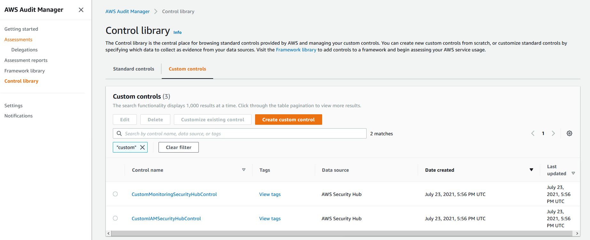
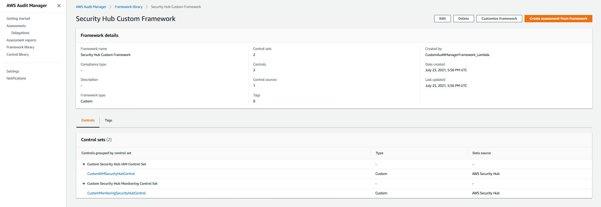
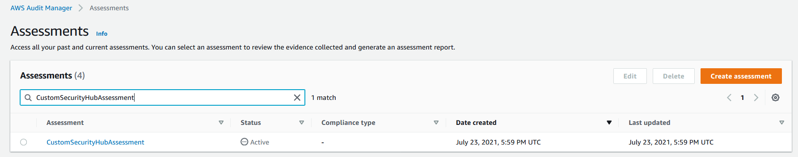

## Automate building of custom Audit Manager Assessments based on Security Hub findings

## Overview
AWS Security Hub provides an out of the box integration with AWS Audit Manager where Security Hub findings based on Security Hub security standards are sent to Audit Manager. If compliance checks from Security Hub security standards are the only data source for an Audit Manager control then the out of the box Audit Manager control set (as well as the Audit Manager framework and assessment) correspond to one of the three supported AWS Security Hub security standards – Foundational Security Best Practices (FSBP), Center for Internet Security (CIS) or Payment Card Industry (PCI).

In this lab, we will deploy a solution that builds custom controls in AWS Audit Manager based on Security Hub findings

The Audit Manager custom controls are organized into control sets. The custom control set in our solution contains AWS Audit Manager controls related to AWS Security Hub findings that span across the FSBP, CIS and PCI standards.  The Audit Manager control set is not specific to the Security Hub security standard but it is specific to a security-related domain (for example, identity management or network monitoring). The Audit Manager control set includes controls from all three Security Hub security standards (FSBP, CIS or PCI) as they relate to that specific domain. This is a common use case where customers want to delegate audit assurance responsibilities to security administrators based on their subject matter expertise.

Refer to [Integrate across the Three Lines Model (Part 1): Build a custom automation of AWS Audit Manager with AWS Security Hub](https://aws.amazon.com/blogs/mt/integrate-across-the-three-lines-model-part-1-build-a-custom-automation-of-aws-audit-manager-with-aws-security-hub/) for a full description of this solution. 

## Prerequisites
1.	[Enable Security Hub](https://docs.aws.amazon.com/securityhub/latest/userguide/securityhub-enable.html#securityhub-enable-console) in your account
2.  [Setup AWS Audit Manager](https://docs.aws.amazon.com/audit-manager/latest/userguide/setting-up.html#setup-audit-manager). In the [AWS Audit Manager console](https://console.aws.amazon.com/auditmanager/home), configure your [AWS Audit Manager settings](https://docs.aws.amazon.com/audit-manager/latest/userguide/console-settings.html).
3. Create an [IAM user with Audit owner permissions](https://docs.aws.amazon.com/audit-manager/latest/userguide/security_iam_service-with-iam.html#security_iam_service-with-iam-id-based-policies). You can use the AWSAuditManagerAdministratorAccess policy as a starting point for this lab, but scope down these permissions as appropriate for your requirements.
4. Create an Amazon S3 bucket with the following name: s3-customauditmanagerframework-*AccountId*-*Region* where *AccountId* is your AWS account ID and *Region* is the AWS Region where you plan to deploy the CloudFormation templates. In this bucket, create a folder named *CustomAuditManagerFramework_Lambda*. [Create a directory](https://docs.aws.amazon.com/AmazonS3/latest/user-guide/create-folder.html) and then upload the [CustomAuditManagerFramework_Lambda.zip](https://github.com/aws-samples/aws-securityhub-remediations/blob/main/aws-auditmanager-securityhub/lambda/CustomAuditManagerFramework_Lambda.zip) file there.
4. If you have already configured an [assessment reports destination](https://docs.aws.amazon.com/audit-manager/latest/userguide/console-settings.html#settings-destination) in your AWS Audit Manager settings, you can skip this step. Otherwise, you can simply reuse the Amazon S3 bucket you created in step 4. The bucket must be in the same AWS Region as your assessment. Create a folder in the bucket for evidence and then [create a directory](https://docs.aws.amazon.com/AmazonS3/latest/user-guide/create-folder.html). Your assessment reports destination will be the Amazon S3 URI (for example, s3://s3-customauditmanagerframework-*AccountId*-*Region*/evidences/). AWS Audit Manager will save your assessment reports to this bucket.
5. Audit Manager works with the [Boto3 1.7](https://boto3.amazonaws.com/v1/documentation/api/1.7.74/index.html) libraries. AWS Lambda doesn’t ship with Boto3 1.7 by default. This implementation provides that version of Boto3 as a [Lambda layer](https://docs.aws.amazon.com/lambda/latest/dg/configuration-layers.html). Upload the [auditmanagerlayer.zip](https://github.com/aws-samples/aws-securityhub-remediations/blob/main/aws-auditmanager-securityhub/layer/auditmanagerlayer.zip) to the top directory of the Amazon S3 bucket you created in step 4.

## Install the solution

1. In the [AWS Audit CloudFormation console](https://console.aws.amazon.com/cloudformation), create a stack to launch the [aws-auditmanager-securityhub.yml](https://github.com/aws-samples/aws-securityhub-remediations/blob/main/aws-auditmanager-securityhub/cft/aws-auditmanager-securityhub.yml) template. In **Parameters**, enter the values for the parameters based on their descriptions in the template. The template takes the following parameters:
**SourceBucket**: The name of the Amazon S3 bucket that contains the AWS Lambda source code. This is the bucket you created in step 3 of the prerequisites. Replace <AccountID> and <Region> with the AWS account ID and Region where you are deploying this template.

2. In the [AWS Audit CloudFormation console](https://console.aws.amazon.com/cloudformation), create a stack to launch the [aws-auditmanager-customassessment.yml](https://github.com/aws-samples/aws-securityhub-remediations/blob/main/aws-auditmanager-securityhub/cft/aws-auditmanager-customassessment.yml) template. In **Parameters**, enter the values for the parameters based on their descriptions in the template. The template takes the following parameters:
**AssessmentDestination**: The S3 URI in which AWS Audit Manager will save your assessment reports. This is the S3 URI from step 4 of the prerequisites. Replace *AccountID* and *Region* with the AWS account ID and Region where you are deploying this template.
**AuditOwnerArn**: The ARN for the IAM user that you created in step 3 of the prerequisites.

## Review the Custom Audit Manager Controls, Framework and Assessment

1. Navigate to the [AWS Audit Manager console](https://console.aws.amazon.com/auditmanager/home). From the left panel, select **Control library** and then select **Custom Control** on the right panel. You will see the list of custom controls that have been created for IAM and Networking monitoring related areas that span across the Security Hub compliance standards.

2. From the left panel, select **Framework Library** and then select **Custom Framework** on the right pane to view the custom Audit Manager framework *Security Hub Custom Framework* that was provisioned by the solution.

3. Select the custom framework from the previous step.  Under the **Control** section, you will see that this framework incorporates custom Security Hub controls that you reviewed in the **Custom Control** tab from Step 1.

4. On the left hand panel, select **Assessments** and you will see that a custom assessment was provisioned by the solution. Select the custom assessment named **CustomSecurityHubAssessment** and view the custom controls that correspond to the assessment.

Once you create an assessment, it will automatically start collecting evidence for the custom controls that you have configured within the assessment. It may take 24 hours for the evidence to appear on the Audit Manager Console.