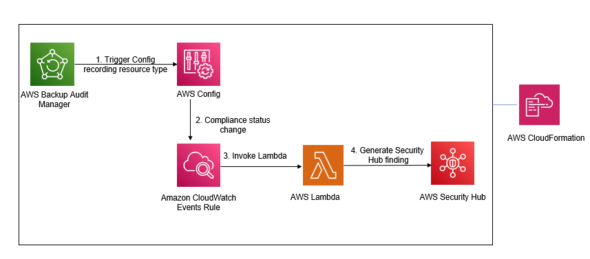

# Automated backup compliance with AWS Backup Audit Manager and AWS Security Hub

Integrates Backup Audit Manager with Security Hub. The solution provisions a AWS Backup Audit Manager framework with 5 default controls (and you can additional controls to the template). These generate and trigger AWS Config rules and the rule evaluations are converted to Security Hub findings.

## Prerequisites

1.  Enable resource tracking for AWS Backup Audit Manager
2.  Enable Security Hub

## How it Works
1.  Provisions AWS Backup Audit Manager framework
2.  Provisions Amazon CloudWatch Events (EventBridge) Rule:
    1. The CloudWatch Events Rule is triggered based on a compliance change of a backup control
3.  Provisions AWS Lambda as a target for the CloudWatch Events Rule:
    1. Obtains event details from the Config recording resource type and converts rule evaluation to a security hub finding

## Solution Architecture

## Install

1. 1 step install - Launch the [**aws-backupauditmanager-securityhub.yaml**](https://github.com/aws-samples/aws-securityhub-remediations/blob/main/aws-backupauditmanager-securityhub/cft/aws-backupauditmanager-securityhub.yaml) template. The template takes no parameters.

## Test

1. Launch an EC2 instance/RDS/Aurora etc without an associated backup plan
2. Validate that an AWS Config rule gets generated and evaluated based on evaluation of the BACKUP_RESOURCES_PROTECTED_BY_BACKUP_PLAN control from the provisioned Backup Audit Manager framework
3. Validate that a security hub finding gets generated based on the Config rule evaluation

