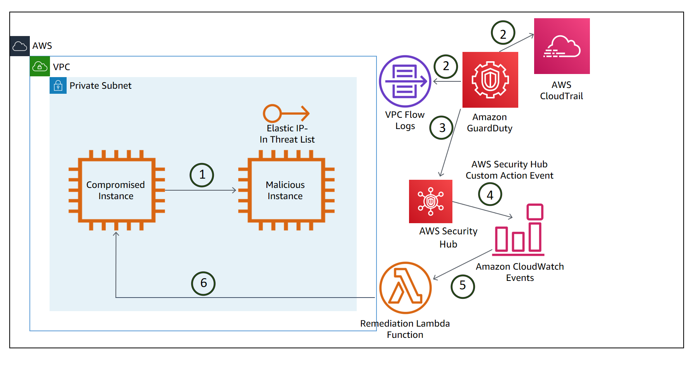

## AWS GuardDuty Detection with AWS Security Hub Remediation 

 1. AWS GuardDuty **Detects** Findings; AWS Security Hub **Remediates** those findings.
 2. **AWS GuardDuty** - Provides automated finding generation for EC2 Malicious IP, EC2 Brute Force Attacks and non compliant IAM Password Policy change. Can be extended for any GuardDuty EC2 or IAM related threat findings. 
 3. **AWS Security Hub** - Automated Remediations for AWS GuardDuty Findings with AWS Security Hub Custom Actions

## How it Works

1. Automated - Automated Attack generation for EC2 Malicious IP and Brute Force Attacks. 
2. User Generated - Update Password Policy to a non CIS compliant password policy.
3. AWS GuardDuty detects and sends findings to AWS Security Hub
4. AWS Security Hub Custom Actions are provisioned by the CloudFormation template. Remediate GD Findings based on user action

## Solution Design

## How To Install - 

0. Step 0 - Pre-req:  1) Enable GuardDuty and Security Hub from the AWS Console. 2) Create an EC2 Key Pair.

1. **Template 1 of 2:** vpc-setup-v1.json
* 1-click install. No parameters needed.
* Provisions a multiple VPC environment to provide an AWS environment with built-in security groups and networking

2. **Template 2 of 2:** aws-guarddutydetect-securityhubremediate-v1.yml
* 1-click install. Enter EC2 key pair.
* After the install - Add EIP of EC2 in VPC3 to a text based threat list; upload threat list to the provisioned S3 bucket. Added S3 URL to GuardDuty Threat List

## @kmmahaj

